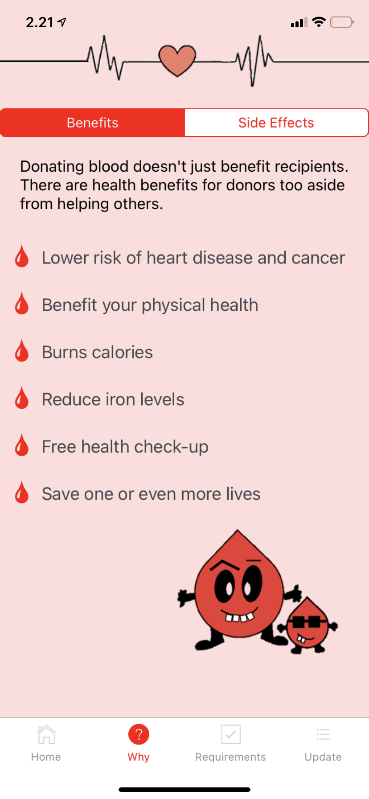

## Blood Donor Community Project
Despite being the world's fourth largest population, the Red Cross in Indonesia is always low on blood supplies due to a lack of donors. Indonesia always has emergency situations due to earthquakes, tsunamis, and volcanic eruptions that cause huge demand for blood. After volunteering at a blood donor event organized by Beauty of Sharing (Indahnya Berbagi) for three years, I saw the need to solve this problem. 

Eventually, I decided to create a mobile application for the IOS called "Indo Liquid Life" using React Native. The app show details of events, informs people about the benefits of donating blood, and give updates on the number of successful blood donors. The hope is that the app will result in getting more people to come and donate blood to the Red Cross. 

## Images

  
  
  

